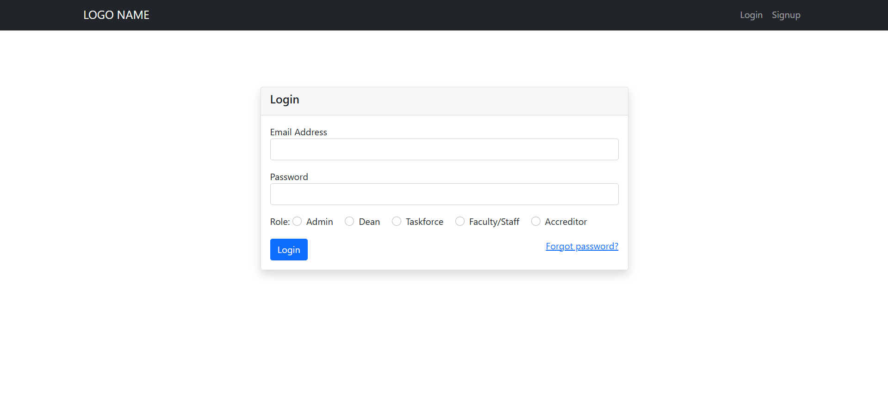

# Login and Signup System with Multi-User Roles and Email Verification

This project is a PHP-based login and signup system that supports multiple user roles (e.g., Admin, Dean, Taskforce, Faculty/Staff, Accreditor) with email verification functionality. The system allows users to create an account, log in, reset their password, and verify their email address.

## Features

- **User Authentication:**
  - Secure login and signup functionality with hashed passwords.
- **Multi-User Roles:**
  - Supports roles like Admin, Dean, Taskforce, Faculty/Staff, and Accreditor.
- **Email Verification:**
  - Sends a verification email to ensure account authenticity.
- **Password Reset:**
  - Enables users to reset their password via email.
- **Responsive UI:**
  - Clean and user-friendly interface for all roles.
- **Secure Operations:**
  - Follows best practices for user management and security.

## Project Structure

- **Authentication Logic:**
  - `portal/authentication.php` - Handles user authentication.
  - `portal/logincode.php` - Handles the logic for login.
  - `portal/signup.php` - User signup form.
  - `portal/verify-email.php` - Handles email verification.

- **Password Management:**
  - `portal/password-change.php` - Allows users to change their password.
  - `portal/password-reset.php` - Password reset form.
  - `portal/password-reset-code.php` - Handles password reset logic.

- **Dashboard:**
  - `portal/dashboard.php` - User dashboard after login.

- **Includes:**
  - `includes/header.php` - Header template.
  - `includes/navbar.php` - Navigation bar.
  - `includes/footer.php` - Footer template.

- **Database Connection:**
  - `portal/dbcon.php` - Manages the database connection.

- **Miscellaneous:**
  - `portal/logout.php` - Handles user logout.
  - `index.php` - Entry point for the application.

- **Database:**
  - `db/qams.sql` - Pre-configured database file.

## Prerequisites

- **PHP**: Version 7.4 or higher.
- **Composer**: Dependency manager for PHP.
- **Database**: MySQL or compatible database.

## Installation

1. Clone the repository or download the ZIP file:
   ```bash
   git clone https://github.com/johnpaulocumen/login-and-signup-multi-users-role-with-verification.git

## Project Screenshot
Here’s what the project looks like in action:

